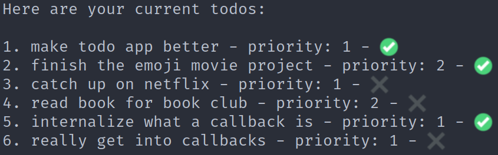

# Todui 4

It's the final TODO... [Doo do DOOO do. Do do DO DO DO.](https://www.youtube.com/watch?v=9jK-NcRmVcw)

### Showing Completion

Our journey starts at displaying not just our todos' text, but whether they're complete or not.

* Check out the variables COMPLETE_MARK and INCOMPLETE_MARK; we've assigned them some quick emojis to show checkmarks and Xs, but you can certainly replace them with your own. Either way, that's how you'll access the marks to show completeness.
* So how do we use them? Well, where we were previously just printing out the number and text of each todo, now we can print out a mark after that text to show whether it's complete or not. In your displaying-all-todos code, print out the appropriate mark based on each todo's `isComplete` property. There are a two main ways to do this:
  * Create a string with `let`, then build it out. Add the todo's number, then the `text` property, then, with an `if`, check its `isComplete` property and add the appropriate mark if it is or isn't complete.
  * Use a ternary to give you the correct mark. The nice thing here is that you avoid a length `if` and, if you do it right, make everything nice and `const`.
  
You'll know you're done with this part when your todos all print out with completion marks. And, of course, those marks should match the todos in `data.js`!

### Marking A Todo Complete

Okay, let's add a feature! Or, at least... half of one. We'll start out just checking them off, then we'll switch to toggling after.

* First thing's first: our menu. If they choose 4, we want to run a toggling-a-todo's-completion-status function. So! Get rid of any Under Construction message you have, and in its place, display our numbered list of todos for them to choose from, and ask them an `interface.question` about which todo they want to check/uncheck. Pass to `interface.question` a `toggleComplete` function (or whatever you'd like to call it), and make that function. The rest of our work for this step will be in that function!
* How is our user going to tell us what to mark? Just like with `remove` in the last part, they're going to pass us in our number (which we'll have to convert to an index, of course!). But this time, instead of _removing_ the todo entirely from the array, we're going to _change a property_ of the todo.

  For now, let's grab the todo. We want to save into a variable (`todo`) the todo that the user asked us for. It will be at the index ONE BEFORE the parameter we were passed. In other words, if the user typed `3` when asked which todo they wanted to toggle, we want to grab the todo at index `2`.
  
  You can confirm this works by console.logging the `todo` you saved, running your app, and seeing if your printing matches the one you selected when you chose the toggle option.
  
* Now, that we have that todo, let's change its `isComplete` property to `true`. We should be toggling it, but let's see if we can at the least just change it.
  
  Once you've done that, still in this function, display all todos again. You should see the todo you selected updated with a checkmark!

* You may have noticed that the previous bullet point didn't send you back to the menu. Let's call our `interface.question` to send us back to the menu, if you haven't already. Now you can mark as many complete as you want, add some more todos, mark THOSE as complete, and so on.

### TOGGLING Completeness

So marking complete is nice, but let's actually give them a chance to toggle stuff back and forth.

The simplest way to solve this problem is with a good ol' `if/else` block. If the `todo` is complete, change its `isComplete` to `false`; if it's not, change it to `true`.

  Alternately, if you want to use a ternary here, that's a bit cleaner! Just make sure, as always with ternaries, that you're using what the ternary evaluates to, and not putting something like `todo.isComplete =` twice. Ternaries are not for "side effects", but just for getting one value based on a boolean. [A really good article on how to use ternaries effectively.](https://blog.webdevsimplified.com/2020-05/ternary-operator/)
  
  Alternately, you can simply use `!` (the bang operator) on the old value of `todo.isComplete` to make a `true` into a `false` and vice versa. Cleanest solution possible!

  Any way you do it, you'll know you've got it when you can toggle a todo's completion status back and forth!
  
  
### Toggling Priority

Really the same thing as the aboe step, except priority is a number instead of a boolean. If the priority is `1`, set it to `2`, and vice versa!

But we DO have to first:

1. Add priorities to our todo-printing loops, so that it looks something like this:

  

2. Wire it all together, with an option in our menu that ask the user which todo to toggle, and an `interface.question` call that gives `node` a function to call when the user enters their todo's number.

### Removing Completed

This one's a filter operation, cutting down our todos to just those that aren't complete yet. Remember `filter`? Yeah, you remember them.

* Wire it up! We don't need to ask a followup question for once, just run a function if their menu input is `3`. We don't need to know what their new todo is called, or remove/toggle an existing one... as soon as they select 3, we have all the info we need. So just make a new function (so that our code isn't right in the middle of our menu-handling function), and call it.
* Now! We're not doing any `return`ing in this code, and we'll keep to that paradigm. Instead, we're going to _reassign_ our `todos` array to be a filtered version of itself. This means going up to where we made our `todos` variable and changing its assignment from `const` to `let`.
* Now that that's set up, we can reassign `todos` to be the result of calling `todos.filter` and passing it a function (inline and arrow if you wanna push yourself!) that returns true if the given todo is not complete). That's a lot in one bullet point, but... you can do it!
* If `.filter` is a little busy for your current syntax skills, you could always make a new empty array, loop through `todos`, and only `.push` into the new array if the current todo is incomplete. Then reassign `todos` to be that now-no-longer-empty array. Manual is always good anyway for reminding us how `.filter` works!

### Stretch Goals

Coming soon!
